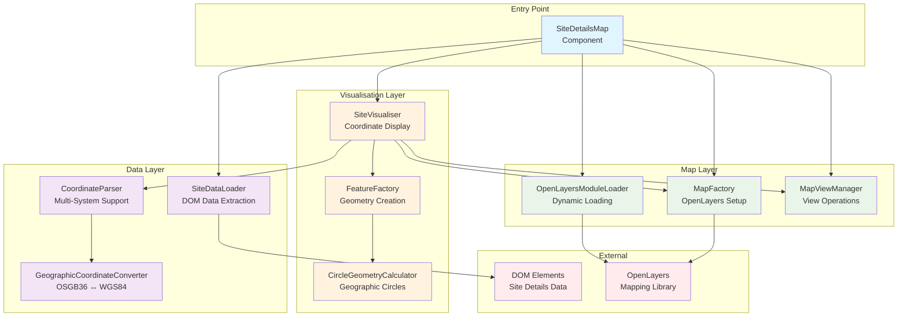

# Site Details Map Module

A comprehensive mapping solution for visualising marine licensing site coordinates using OpenLayers. This module supports multiple coordinate systems, file uploads, and manual coordinate entry for displaying site boundaries on an interactive map.

## Architecture Overview

The module follows a clean architecture pattern with clear separation of concerns, dependency injection for testability, and modular design for maintainability.



## Core Components

### 🎯 **SiteDetailsMap** (`index.js`)

**Main orchestrator extending GOV.UK Component**

- **Responsibility**: Entry point and lifecycle management
- **Key Features**:
  - Asynchronous map initialisation with error handling
  - Dependency injection for testability
  - Site details validation and display coordination
  - Fallback error handling for failed initialisations

```javascript
// Usage
const mapElement = document.querySelector('[data-module="site-details-map"]')
new SiteDetailsMap(mapElement)
```

### 📊 **SiteDataLoader** (`site-data-loader.js`)

**DOM data extraction and validation**

- **Responsibility**: Extract and validate site coordinates from DOM
- **Supported Types**:
  - File coordinates (GeoJSON from uploads)
  - Manual coordinates (WGS84, OSGB36)
  - Polygon coordinates (multiple coordinate arrays)

### 🗺️ **MapFactory** (`map-factory.js`)

**OpenLayers map instance creation**

- **Responsibility**: Configure and create map components
- **Features**:
  - OSM tile layer with custom attribution
  - Vector layers with styling
  - Responsive attribution control
  - Metric scale line
  - Default UK-centred view

### 🎨 **SiteVisualiser** (`site-visualiser.js`)

**Coordinate visualisation orchestrator**

- **Responsibility**: Display different coordinate types on map
- **Display Types**:
  - **Point sites**: Single coordinate markers
  - **Circular sites**: Radius-based boundaries
  - **Polygon sites**: Multi-coordinate boundaries
  - **File upload data**: GeoJSON features

### 🏗️ **FeatureFactory** (`feature-factory.js`)

**OpenLayers feature creation**

- **Responsibility**: Create map features from coordinates
- **Feature Types**:
  - Point features for markers
  - Circle features with geographic accuracy
  - Polygon features with automatic closure
  - GeoJSON feature imports

### 🔄 **CoordinateParser** (`coordinate-parser.js`)

**Multi-system coordinate processing**

- **Responsibility**: Parse and transform coordinates
- **Supported Systems**:
  - **WGS84**: GPS coordinates (latitude/longitude)
  - **OSGB36**: British National Grid (eastings/northings)
- **Features**:
  - Automatic system detection
  - Batch processing for polygons
  - Web Mercator projection output

### 📐 **GeographicCoordinateConverter** (`geographic-coordinate-converter.js`)

**Coordinate system transformations**

- **Responsibility**: OSGB36 ↔ WGS84 conversions
- **Implementation**: Uses Proj4js with Helmert transformation parameters
- **Accuracy**: Survey-grade transformations for marine licensing precision

### ⭕ **CircleGeometryCalculator** (`circle-geometry-calculator.js`)

**Geographic circle calculations**

- **Responsibility**: Generate accurate circular boundaries
- **Algorithm**: Spherical trigonometry for geographic accuracy
- **Features**:
  - Configurable point density
  - Great circle calculations
  - Automatic polygon closure

### 🎛️ **MapViewManager** (`map-view-manager.js`)

**Map view operations**

- **Responsibility**: Control map viewport and zoom
- **Operations**:
  - Fit to coordinate extents
  - Centre on specific points
  - Fallback to UK centre on errors
- **Error Handling**: Graceful degradation with logging

### 📦 **OpenLayersModuleLoader** (`openlayers-module-loader.js`)

**Dynamic module loading**

- **Responsibility**: Load OpenLayers components on-demand
- **Benefits**:
  - Reduced initial bundle size
  - Conditional loading based on usage
  - Import error handling

## Data Flow

### 1. **Initialisation Flow**

```
User loads page → SiteDetailsMap constructor → scheduleMapInitialisation →
loadSiteDetails → validateCoordinates → loadOpenLayersModules →
createMapComponents → displayCoordinates
```

### 2. **Coordinate Processing Flow**

```
DOM Data → SiteDataLoader → CoordinateParser →
[WGS84/OSGB36 handling] → GeographicCoordinateConverter →
Web Mercator coordinates → FeatureFactory → OpenLayers Features
```

### 3. **Display Flow**

```
Site Details → SiteVisualiser →
[Point/Circle/Polygon logic] → FeatureFactory →
Map Features → MapViewManager → Viewport Update
```

## Coordinate System Support

### **WGS84 (World Geodetic System 1984)**

- **Format**: Decimal degrees (latitude, longitude)
- **Example**: `51.550000, 0.700000`
- **Use Case**: GPS coordinates, international standards

### **OSGB36 (Ordnance Survey Great Britain 1936)**

- **Format**: Eastings and northings in metres
- **Example**: `577000, 178000`
- **Use Case**: UK mapping, marine licensing submissions

### **Web Mercator (EPSG:3857)**

- **Format**: Projected coordinates in metres
- **Use Case**: Web mapping display (internal use)

## Feature Types

### **Point Sites**

Single coordinate locations displayed as markers

```javascript
// Example data structure
{
  coordinateSystem: 'WGS84',
  coordinates: { latitude: '51.5', longitude: '-0.1' }
}
```

### **Circular Sites**

Centre point with radius, displayed as accurate geographic circles

```javascript
// Example data structure
{
  coordinateSystem: 'WGS84',
  coordinates: { latitude: '51.5', longitude: '-0.1' },
  circleWidth: '500' // metres diameter
}
```

### **Polygon Sites**

Multiple coordinates forming site boundaries

```javascript
// Example data structure
{
  coordinateSystem: 'WGS84',
  coordinatesEntry: 'multiple',
  coordinates: [
    { latitude: '51.55', longitude: '0.70' },
    { latitude: '51.52', longitude: '1.00' },
    { latitude: '51.45', longitude: '1.10' }
  ]
}
```

### **File Upload Sites**

GeoJSON data from uploaded shapefiles or KML files

```javascript
// Example GeoJSON structure
{
  type: 'FeatureCollection',
  features: [
    {
      type: 'Feature',
      geometry: { type: 'Polygon', coordinates: [[...]] },
      properties: {}
    }
  ]
}
```

## Error Handling Strategy

### **Graceful Degradation**

- Invalid coordinates → fallback to UK centre
- Missing data → error message display
- Module loading failures → user-friendly error
- Map fitting errors → logged warnings with fallback

### **Validation Layers**

1. **DOM Level**: Check data presence and format
2. **Coordinate Level**: Validate coordinate values and systems
3. **Feature Level**: Ensure sufficient coordinates for shapes
4. **Display Level**: Handle rendering failures gracefully

## Performance Considerations

### **Lazy Loading**

- OpenLayers modules loaded only when needed
- Map initialisation scheduled after DOM ready
- Feature creation optimised for large datasets

### **Memory Management**

- Features cleared before new displays
- Event listeners properly managed
- Module imports cached

### **Rendering Optimisation**

- Vector layers for interactive features
- Appropriate zoom level constraints
- Responsive attribution for smaller screens

## Testing Strategy

### **Unit Tests**

- Individual component functionality
- Coordinate transformation accuracy
- Error handling scenarios
- Mock-based isolation

### **Integration Tests**

- End-to-end coordinate display
- File upload processing
- Map interaction behaviour
- Cross-browser compatibility

### **Test Data**

- Realistic UK marine coordinates
- Thames Estuary reference points
- Edge case scenarios (invalid data, boundary conditions)

## Configuration Constants

```javascript
// Default map settings
DEFAULT_UK_CENTRE_LONGITUDE = -3.5
DEFAULT_UK_CENTRE_LATITUDE = 54.0
DEFAULT_MAP_ZOOM = 6
DEFAULT_MAP_PADDING = 20

// Geometry settings
MINIMUM_POLYGON_COORDINATES = 3
CIRCLE_APPROXIMATION_SIDES = 64
EARTH_RADIUS_METRES = 6378137

// Map styling
STROKE_WIDTH_PIXELS = 2
SMALL_MAP_SIZE = 600 // for responsive attribution
```

## Browser Support

- **Modern Browsers**: Full functionality with ES6+ features
- **IE11**: Not supported (uses ES6 modules and async/await)
- **Mobile**: Responsive design with touch-friendly controls

## Dependencies

- **OpenLayers**: Interactive mapping library
- **Proj4js**: Coordinate system transformations
- **GOV.UK Frontend**: Component base class and styling

## Future Enhancements

- **Additional Coordinate Systems**: Support for UTM zones
- **Advanced Editing**: Interactive coordinate editing
- **Export Functionality**: Download displayed areas as files
- **Measurement Tools**: Distance and area calculations
- **Layer Management**: Multiple overlay support

---

_This module provides a robust, testable, and maintainable solution for marine licensing coordinate visualisation, following government digital service standards and best practices._
