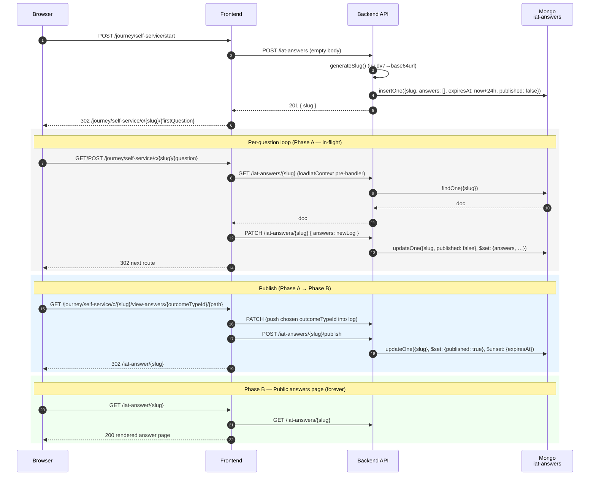
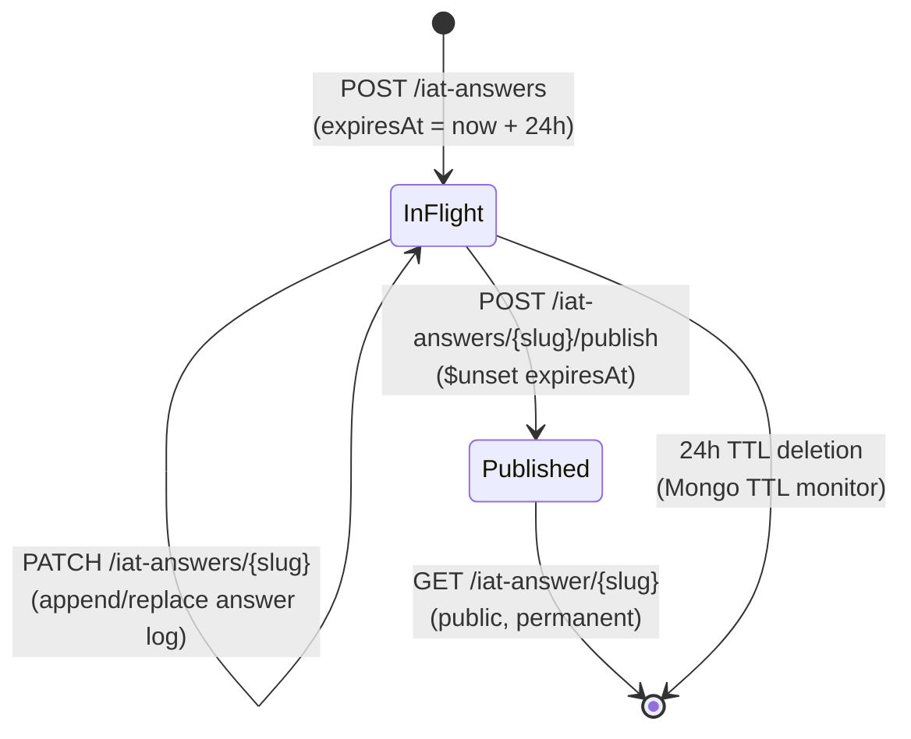

# Interactive Assistance Tool (IAT)

The Marine Licence Interactive Assistance Tool is a decision-tree
walkthrough that helps members of the public determine whether their
planned marine activity needs a marine licence. It is anonymous (no Defra
ID) and driven entirely by a JSON configuration file.

This README is the top-level entry point for IAT engineers. For the two
deeper-dive areas, see:

- [`data/README.data.md`](./data/README.data.md) — the `self-service.json`
  configuration model: question/outcome/outcomeType schema, the multiSelect
  rules, the five journey phases, HTML sanitisation expectations.
- [`services/README.data-quality.md`](./services/README.data-quality.md) —
  the load-time and runtime config-defect logger
  (`runLoadTimeScan` / `reportRuntimeIssue`), its ECS log shape, and the
  bounded `seenRuntimeIssues` set.

## File map

```
src/server/journey/self-service/
├── start/        # GET/POST /journey/self-service/start                                 (ML-1162)
├── invalid/      # GET      /journey/self-service/invalid                               (ML-1306)
├── question/     # GET/POST /journey/self-service/c/{slug}/{questionPath*}              (ML-1186, ML-1304/1306)
├── outcome/      # GET/POST /journey/self-service/c/{slug}/outcome/{outcomePath*}       (ML-1164, ML-1304/1306)
│                 # GET      /journey/self-service/c/{slug}/view-answers/{...}           (ML-1165, ML-1304/1306)
├── answer/       # GET      /iat-answer/{slug}                                          (ML-1165, ML-1306)
├── data/         # self-service.json + load-time parser/sanitiser
└── services/     # journey-data, journey-router, journey-answer-log, application-handoff,
                  # load-iat-context, data-quality, sanitise
```

Note: `session-answers.js` and `iat-answers-payload.js` are GONE. The new modules are `journey-answer-log`, `application-handoff`, and `load-iat-context`.

All route plugins are registered conditionally in
[`src/server/router.js`](../../router.js) when `selfService.enabled` is
true. Frontend routes are `auth: false`; backend `/iat-answers` endpoints
run with `auth: { mode: 'optional' }`.

## Routes

| Method | Path                                                                         | Purpose                                                                                                                  | Source      |
| ------ | ---------------------------------------------------------------------------- | ------------------------------------------------------------------------------------------------------------------------ | ----------- |
| GET    | `/journey/self-service/start`                                                | Pre-walkthrough landing page                                                                                             | `start/`    |
| POST   | `/journey/self-service/start`                                                | Mint a slug + empty iat-answers doc; redirect to first question under slug-prefixed URL                                  | `start/`    |
| GET    | `/journey/self-service/invalid`                                              | "This check has expired or could not be found" page                                                                      | `invalid/`  |
| GET    | `/journey/self-service/c/{slug}/{questionPath*}`                             | Render a question; selectedAnswers from the slug's iat-answers doc                                                       | `question/` |
| POST   | `/journey/self-service/c/{slug}/{questionPath*}`                             | PATCH the iat-answers doc with the new answer log, redirect to next node                                                 | `question/` |
| GET    | `/journey/self-service/c/{slug}/outcome/{outcomePath*}`                      | Render outcome. Terminal-single: PATCH the chosen outcomeTypeId into the log. Terminal-multi: no patch (selection later) | `outcome/`  |
| POST   | `/journey/self-service/c/{slug}/outcome/{outcomePath*}`                      | Intermediate selection — PATCH chosen outcomeTypeId, redirect to its `nextQuestionRoute`                                 | `outcome/`  |
| GET    | `/journey/self-service/c/{slug}/view-answers/{outcomeTypeId}/{outcomePath*}` | PATCH the chosen outcomeTypeId, POST `/iat-answers/{slug}/publish`, 302 to `/iat-answer/{slug}`                          | `outcome/`  |
| GET    | `/iat-answer/{slug}`                                                         | Render the public, permanent answer page                                                                                 | `answer/`   |

The catch-all paths on question and outcome resolve through
`services/journey-data.js` and `services/journey-router.js`; see
[`data/README.data.md`](./data/README.data.md) for the routing rules.

## Request lifecycle

A walkthrough has two persistence phases on one Mongo collection
(`iat-answers`) keyed by a single slug.

**Phase A — In-flight (24h TTL).** The slug doubles as the per-tab
context ID (closes ML-1304) and as a path segment on every IAT URL.
Answers accumulate via PATCH requests to the backend; the doc
self-deletes if abandoned, via a Mongo TTL index on `expiresAt`.

**Phase B — Published (permanent).** When the user reaches a terminal
outcome and clicks "View answers", the backend `$unset`s `expiresAt`
and sets `published: true`. The doc is now durable forever — the answer
URL is publicly bookmarkable, by design, because it gets embedded in
downstream exemption records.



The same lifecycle as a state machine:



The pre-handler [`services/load-iat-context.js`](./services/load-iat-context.js)
runs on every `c/{slug}/…` route — it fetches the doc, redirects to
`/journey/self-service/invalid` on missing-or-published, and stashes the
doc on `request.app.iatDoc` for the handler.

## Backend `iat-answers` contract

The backend exposes four endpoints, all `auth: { mode: 'optional' }`:

| Backend route                 | Method | Purpose                                                                         |
| ----------------------------- | ------ | ------------------------------------------------------------------------------- |
| `/iat-answers`                | POST   | Insert empty doc with server-generated slug and `expiresAt = now + 24h`         |
| `/iat-answers/{slug}`         | PATCH  | Replace the `answers` log (filtered `published: false`; rejected after publish) |
| `/iat-answers/{slug}/publish` | POST   | Set `published: true`, `$unset expiresAt`. Doc becomes permanent.               |
| `/iat-answers/{slug}`         | GET    | Return doc body (`_id` stripped)                                                |

The slug is a 22-character base64url encoding of a UUIDv7 (RFC 9562):
48-bit timestamp prefix, 74 bits of random, 4 version bits, 2 variant
bits — 128 bits in the URL alphabet. Generated server-side only — the
frontend never generates or sees the algorithm.

**Mutability rules.**

- The `answers` log is replaceable while `published: false`. The trim-and-append
  logic for re-answered questions lives in
  [`services/journey-answer-log.js`](./services/journey-answer-log.js)
  on the frontend; the backend just accepts the canonical array.
- The doc is immutable after publish. PATCH returns 404 once `published: true`.
- The slug is permanent across the transition — the same URL works in
  Phase A and Phase B.

## Config flags

| Key                              | Env var                   | Default | Effect                                                                                                                                          |
| -------------------------------- | ------------------------- | ------- | ----------------------------------------------------------------------------------------------------------------------------------------------- |
| `selfService.enabled`            | `ENABLE_SELF_SERVICE`     | `false` | Registers the IAT route plugins and the data-quality init plugin. When false, all IAT URLs return 404.                                          |
| `selfService.dataQualityEnabled` | `ENABLE_IAT_DATA_QUALITY` | `false` | Runs `runLoadTimeScan` on Hapi `start` to log defects in `self-service.json`. Runtime defect logging in handlers is **not** gated by this flag. |

## Security: defence in depth

The IAT's threat model is unusual: the routes are public-by-design (no
Defra ID), and answer URLs are _intentionally_ shareable — they get linked
from the public ArcGIS map layer that already publishes exemption
locations, and will do the same for marine licences when those go live.
That makes some controls (auth, session-bound capability tokens) wrong
for the surface, and shifts the weight onto input validation, sanitisation,
and immutability of public-record artefacts.

The layers below are listed roughly outermost-first. Each row names what
it actually defends against — and, where useful, what it does _not_
defend against, so a reader doesn't infer protection that isn't there.

| #   | Defense                                                                      | Where                                                                                                                                                                                                                                                                         | Defends against                                                                                                                                                                                                                                      |
| --- | ---------------------------------------------------------------------------- | ----------------------------------------------------------------------------------------------------------------------------------------------------------------------------------------------------------------------------------------------------------------------------- | ---------------------------------------------------------------------------------------------------------------------------------------------------------------------------------------------------------------------------------------------------- |
| 1   | `selfService.enabled` feature flag                                           | [`src/server/router.js:51`](../../router.js)                                                                                                                                                                                                                                  | Accidental exposure of an incomplete IAT before launch (the plugins are simply not registered when the flag is off)                                                                                                                                  |
| 2   | Joi slug validation `Joi.string().length(22).pattern(/^[A-Za-z0-9_-]{22}$/)` | [`answer/index.js`](./answer/index.js), [`marine-licensing-backend/src/iat-answers/models/iat-answers.js`](../../../../../marine-licensing-backend/src/iat-answers/models/iat-answers.js)                                                                                     | Path traversal, NoSQL injection, and odd-charset trickery via the `{slug}` URL param. Joi rejects with 400 before the controller runs.                                                                                                               |
| 3   | 22-char base64url UUIDv7 slug as URL capability                              | [`marine-licensing-backend/src/iat-answers/api/helpers/generate-slug.js`](../../../../../marine-licensing-backend/src/iat-answers/api/helpers/generate-slug.js)                                                                                                               | Guessing or enumerating answer URLs (74 bits of random plus a 48-bit timestamp the attacker would also need to hit, which together make brute force infeasible). The slug also appears in every journey URL (`c/{slug}/…`), not just the answer URL. |
| 4   | `published: true` filter on PATCH                                            | [`marine-licensing-backend/src/iat-answers/api/controllers/patch-iat-answers.js`](../../../../../marine-licensing-backend/src/iat-answers/api/controllers/patch-iat-answers.js)                                                                                               | Tampering with published answer content. Once `$unset expiresAt` lands, `{ slug, published: false }` filter ensures PATCH returns 404 even if a slug is leaked. Phase A docs are bounded by the 24h TTL described below.                             |
| 5   | Mongo TTL index on `expiresAt`                                               | [`marine-licensing-backend/migrations/{ts}-iat-answers-ttl-index.js`](../../../../../marine-licensing-backend/migrations/)                                                                                                                                                    | Indefinite storage growth from abandoned journeys. Phase A docs auto-delete 24h after creation; the TTL index skips docs whose `expiresAt` is unset (Phase B), so published docs persist forever.                                                    |
| 6   | Identical HTTP response for unknown / expired / published slugs              | [`services/load-iat-context.js`](./services/load-iat-context.js)                                                                                                                                                                                                              | Information disclosure via differing error pages — an attacker probing slugs cannot distinguish "never existed" from "expired" from "published" via the HTTP response.                                                                               |
| 7   | Backend sanitisation of `outcome.summaryText` on insert                      | [`marine-licensing-backend/src/iat-answers/api/helpers/sanitise-summary-text.js`](../../../../../marine-licensing-backend/src/iat-answers/api/helpers/sanitise-summary-text.js)                                                                                               | Stored XSS via the only HTML-bearing field the frontend POSTs. Uses `sanitize-html` with a tag/scheme allowlist that is **byte-identical** to the frontend's `richTextSanitiseOptions` (see the contract comment in `sanitise-summary-text.js`)      |
| 8   | Frontend sanitisation of `self-service.json` content at load time            | [`services/sanitise.js`](./services/sanitise.js), applied by `services/journey-data.js` to `question.hint`, `answer.hint`, `outcome.text`, `outcomeType.text`, with `stripHtml` on `question.text` and `section.text`                                                         | Reflected XSS from configuration content rendered into the IAT pages. Same allowlist as backend `sanitiseSummaryText` plus the `govuk-hint` class transform for hint paragraphs                                                                      |
| 9   | Frontend re-sanitisation of `summaryText` on the answer page                 | [`answer/index.njk:28`](./answer/index.njk) (`\| sanitiseRichText`)                                                                                                                                                                                                           | Stored XSS in the (very unlikely) case that a malicious actor wrote a document directly into Mongo, bypassing layer 7. Defence in depth — the same allowlist is applied at both write and render.                                                    |
| 10  | No PII in the `iat-answers` document body                                    | [`services/journey-answer-log.js`](./services/journey-answer-log.js) — answer log entries carry only `{ questionRoute, answerIds }` for questions and `{ outcomeRoute, outcomeTypeId }` for outcomes; human-readable text is resolved at render time from `self-service.json` | Accidental publication of personal data when the answer URL is shared or indexed. The doc carries only the user's question/answer trail and the rendered outcome text — no name, email, phone, IP, or session ID                                     |
| 11  | Bounded `seenRuntimeIssues` Set (FIFO, 100 entries)                          | [`services/data-quality.js`](./services/data-quality.js), see [`services/README.data-quality.md`](./services/README.data-quality.md)                                                                                                                                          | Process-level memory growth from anonymous traffic that hits a malformed-config branch. Required because the runtime callers are reachable on `auth: false` routes.                                                                                  |

Things this list deliberately does _not_ claim:

- The IAT does **not** carry CSRF protection on its POST endpoints. The
  routes are `auth: false`, there is no per-user session token (the
  walkthrough is identified only by the slug in the URL), and there
  is no persistent state to forge a write against beyond a single
  context. If a future change adds a per-user-bound write, CSRF will
  need to be revisited.
- The IAT does **not** apply application-layer rate limiting. CDP's
  nginx and WAF layers provide platform-level throttling.
- Once **published**, answer URLs do **not** expire and are **not** unlisted
  (this is intentional — they are linkable from public records). Phase A
  (in-flight) docs DO expire after 24h via the Mongo TTL index.

## Tests

- Unit/component: colocated `*.test.js` next to each module.
- Integration: `controller.integration.test.js` files in `start/`,
  `question/`, `outcome/`, `answer/`, `invalid/` — exercise the full Hapi
  handler with `setupTestServer`. Note: config.set propagation is affecting
  several integration tests on this branch; this is a known infrastructure
  issue and a separate ticket, not in scope for ML-1306.
- Accessibility (Axe): every public IAT page variant is covered in
  [`accessibility.test.js`](./accessibility.test.js):
  - start
  - radio-button question (sea, jurisdiction)
  - multiSelect question (maintenance-existing-works)
  - intermediate outcome / fork (journey-select)
  - terminal-single outcome (article 25A)
  - terminal-multi outcome (scaffolding-impede-navigation)
  - answer page (ML-1165, with `iatAnswersService.get` stubbed)
  - invalid page (ML-1306)
- Key service unit tests:
  - `services/journey-answer-log.test.js`
  - `services/load-iat-context.test.js`
  - `services/application-handoff.test.js`
  - `invalid/controller.test.js`
- Contract: the `sanitise-summary-text` allowlist contract between
  frontend and backend is checked by canary tests in both repos. The
  load-bearing comment lives in
  [`marine-licensing-backend/src/iat-answers/api/helpers/sanitise-summary-text.js`](../../../../../marine-licensing-backend/src/iat-answers/api/helpers/sanitise-summary-text.js).
